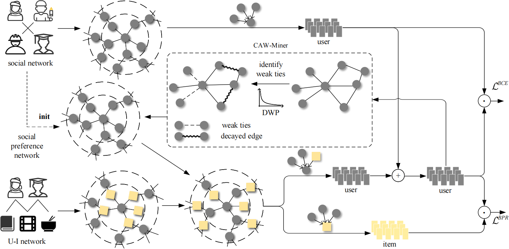

# <u>W</u>eak <u>T</u>ies Guided Mining for <u>S</u>ocial <u>R</u>ecommendation (WT-SR)

This is the PyTorch implementation for **WT-SR** proposed in the paper **Weak Ties Guided Mining for Social
Recommendation**.

> The paper is currently under review.

## Architecture

## Environments

* **python 3.8**
* **pytorch 2.4.0**

## Datasets

| Dataset | Users   | Items    | Interactions | Relations |
|---------|---------|----------|--------------|-----------|
| Ciao    | 	7,355  | 	17,867	 | 140,628	     | 111,679   |
| Yelp    | 	32,827 | 	59,972	 | 598,121	     | 964,510   |
| Douban  | 	2,669  | 	15,940	 | 535,210      | 	32,705   |

## Model Training

To run the experiments, the scripts we provide can be used directly:

``
python main.py
``

## Acknowledgement

The codes are modified from [GDMSR](https://github.com/tsinghua-fib-lab/Graph-Denoising-SocialRec). Thanks for their
excellent work!

